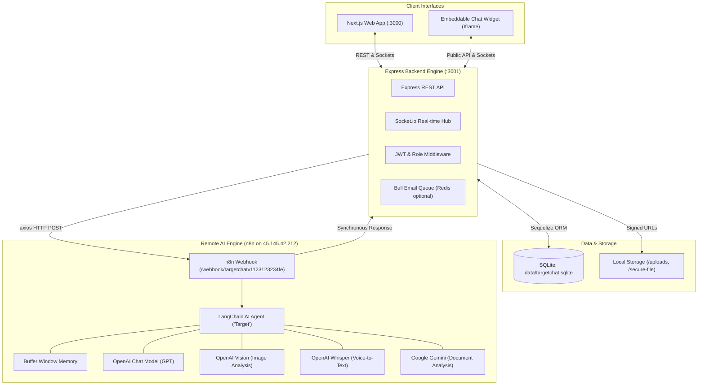

# 🚨 TargetChat — Comprehensive AI Agent Architecture & Technical Guide

> **MANDATORY FOR ANY INCOMING AI AGENT:**
> Read this document first before writing, modifying, or debugging any code in `targetchat/`.
> This file contains the complete system architecture, flow patterns, data models, AI integrations, and runtime instructions.

---

## 1. 📌 Executive Overview

**TargetChat** is a full-stack, real-time, multi-workflow AI communication platform. It enables users and businesses to interact with customizable AI agents, manage team workspaces, deploy embeddable web chat widgets, and execute multimodal AI tasks (text, images, audio, and documents).

* **Frontend:** Next.js 13 (Pages Router), React 18, Tailwind CSS, Socket.io-client.
* **Backend:** Node.js (v18+ / v20+), Express.js 4, Socket.io 4, Sequelize ORM.
* **Database:** SQLite (local development default via `sqlite3`) / MariaDB or MySQL (production/docker).
* **AI Orchestration Engine:** Self-hosted **n8n** automation instance running LangChain agent workflows integrated with **OpenAI** (GPT, Vision, Whisper) and **Google Gemini**.
* **Current Workspace Path:** `targetchat/` (inside the root `u-axis-workspace/`).

---

## 2. 🏛️ High-Level System Architecture



---

## 3. 📂 Repository Layout & Key File Map

```
targetchat/
├── AGENTS.md                   ← [THIS FILE] Primary AI Agent Guide
├── README.md                   ← Standard developer readme
├── docker-compose.yml          ← Production Docker Compose stack
├── ecosystem.config.js         ← PM2 cluster configuration
├── documentation.html          ← Original project technical specification
│
├── backend/                    ← Node.js / Express Backend (Port 3001)
│   ├── .env                    ← Local environment config (DB, JWT, n8n webhook)
│   ├── .env.example            ← Environment template
│   ├── package.json            ← Dependencies (Express, Sequelize, Socket.io, sqlite3, etc.)
│   ├── data/
│   │   └── targetchat.sqlite   ← Active local SQLite database file
│   └── src/
│       ├── index.js            ← Server entrypoint, Socket.io setup, HTTP listener
│       ├── config/
│       │   └── database.js     ← Sequelize connection (handles sqlite fallback & mysql)
│       ├── middleware/
│       │   ├── auth.js         ← JWT verification (`requireAuth`, `requireAdmin`)
│       │   ├── rbac.js         ← Role-based access control (Admin, Manager, Member)
│       │   ├── usageLimit.js   ← Message & token quota enforcer
│       │   └── validation.js   ← Joi input schema validation
│       ├── models/
│       │   ├── index.js        ← Sequelize model loader & entity associations
│       │   ├── user.js         ← User entity (id, email, password, role, isVerified)
│       │   ├── chat.js         ← Chat session (id, title, userId, workflowId, widgetId)
│       │   ├── message.js      ← Message record (id, chatId, sender, text, type, metadata)
│       │   ├── Workflow.js     ← AI persona/workflow model (name, webhookUrl, isPublic)
│       │   ├── Workspace.js    ← Team workspaces
│       │   ├── Widget.js       ← Embeddable chat widgets
│       │   └── SubscriptionPlan.js ← Billing plans and quotas
│       ├── routes/
│       │   ├── auth.js         ← Login, registration, email verification, /me
│       │   ├── chat.js         ← Chat CRUD, message dispatch, n8n trigger
│       │   ├── workflows.js    ← User & Admin workflow catalog
│       │   ├── workspaces.js   ← Team workspace management & invitations
│       │   ├── widgets.js      ← Widget builder & public embed endpoints
│       │   ├── webhook.js      ← Webhook receivers (n8n response callback)
│       │   └── admin/          ← System stats, users, billing, logs
│       ├── services/
│       │   └── emailProvider.js← SMTP / SendGrid / SES email handler
│       └── utils/
│           ├── n8nClient.js    ← Dispatches outgoing chat payloads to n8n webhook
│           └── generateSignedUrl.js ← Generates expiring URLs for file downloads
│
└── frontend/                   ← Next.js 13 Frontend (Port 3000)
    ├── .env.local              ← Contains NEXT_PUBLIC_API_URL=http://localhost:3001
    ├── package.json            ← Next.js, React, Tailwind CSS, Lucide icons, SWR
    ├── pages/
    │   ├── _app.js             ← Global layout, Toast provider, auth state
    │   ├── index.js            ← Landing / redirect logic
    │   ├── login.js            ← Authentication screen
    │   ├── register.js         ← Account registration
    │   ├── dashboard/          ← Analytics, workspace overview
    │   ├── inbox/              ← Real-time unified chat interface
    │   ├── workflows/          ← Workflow selector & agent catalog
    │   ├── widgets/            ← Embeddable widget configuration
    │   ├── billing/            ← Subscription tier selection & payment
    │   └── admin/              ← System admin panel (stats, users, system settings)
    ├── components/             ← Reusable UI components (Sidebar, ChatBox, Modals)
    ├── context/                ← AuthContext, WorkspaceContext, SocketContext
    └── utils/
        └── apiConfig.js        ← Global API base URL configuration
```

---

## 4. 🤖 AI Workflow & n8n Processing Lifecycle

TargetChat decouples AI model execution from the application backend by routing requests through **n8n** webhook automation pipelines:

### The Chat Execution Flow:
1. **User Submits Message:** In the Next.js frontend, the user types a prompt or attaches media (Image, Audio, PDF).
2. **Backend Storage:** Express (`src/routes/chat.js`) saves the user's message into SQLite/MySQL with `sender: 'user'`.
3. **Socket Broadcast:** Socket.io immediately emits the user's message to `chat_{chatId}` room so the UI updates instantly.
4. **Webhook Dispatch:** The backend queries the chat's assigned `Workflow` (or falls back to `N8N_WEBHOOK_URL`) and executes `sendToN8N(payload)` via `axios.post`.
   - Production Endpoint: `https://n8n.u-axis.com/webhook/targetchatv1123123234fe`
5. **n8n Multimodal Router:**
   - **Text:** Routed directly to the LangChain Agent.
   - **Audio:** Processed through **OpenAI Whisper** (`Transcribe a recording`), converted to text, and fed to the Agent.
   - **Images:** Processed through **OpenAI Vision** (`Analyze image`) to generate contextual captions.
   - **Documents:** Processed through **Google Gemini** (`Analyze document`) to extract and summarize contents.
6. **Agent Synthesis:** The LangChain Agent (`Target` persona) consults the `memoryBufferWindow` (retaining prior conversation turns) and uses the OpenAI Chat Model to formulate a structured response.
7. **Response Node:** n8n returns a synchronous JSON response:
   ```json
   {
     "reply": "AI response text here",
     "user_id": 1,
     "chat_id": 12
   }
   ```
8. **Client Delivery:** The backend writes the reply to the database (`sender: 'ai'`) and broadcasts it via Socket.io to the browser.

---

## 5. 🔐 Authentication, Roles & Data Models

### User Roles:
* `admin`: Complete access to `/api/admin/*`, workflow creation, system logs, billing plans.
* `user`: Standard access to workspaces, personal chats, public workflows, and widget management.
* `guest`: Anonymous session for external users interacting via embeddable website widgets (`socket.isGuest = true`).

### Important Authentication Rules:
* All passwords use `bcrypt` hashing with salt rounds of 10.
* Email verification is required (`isVerified: true`) to log in via `/api/auth/login`. When seeding test accounts, always set `isVerified: true`.
* Default Seeded Admin Credentials:
  - **Email:** `admin@targetchat.com`
  - **Password:** `admin123456`

---

## 6. ⚙️ Local Development & Running the App

### Prerequisites:
* Node.js v18 or newer
* npm v9 or newer
* (Optional) Redis on `127.0.0.1:6379` for Bull email queue. If Redis is absent, background email jobs log a warning but the server does NOT crash.

### Running the Services:

```bash
# 1. Backend (Express API on port 3001)
cd targetchat/backend
npm install
# Ensure .env has DB_DIALECT=sqlite and DB_STORAGE=./data/targetchat.sqlite
node src/index.js

# 2. Frontend (Next.js on port 3000)
cd targetchat/frontend
npm install
npm run dev
```

### Quick Health Verification:
```bash
# Check Backend
curl -s http://localhost:3001/
# Expected: {"app":"TargetChat API"}

# Check Frontend
curl -s -I http://localhost:3000/
# Expected: HTTP/1.1 200 OK
```

---

## 7. 🌐 Production Deployment & Server Status (Critical Context)

* **Server IP:** `45.145.42.212` (SSH Port `2629`).
* **Current Status:**
  - The n8n AI engine is **LIVE** and serving webhooks at `https://n8n.u-axis.com`.
  - The TargetChat web application (Next.js + Express) is **NOT YET DEPLOYED** on the server.
  - Port `3000` on the server is currently occupied by `monitoring-grafana`. When deploying TargetChat via Docker on the server, the frontend port must be mapped to an alternative (e.g. `3005:3000`).
  - The application currently has **no public domain or DNS record assigned**. We are waiting for management to specify a domain (e.g., `chat.u-axis.com`).
* **Relationship to U-Axis:**
  - TargetChat was the original project predecessor to U-Axis.
  - The codebase is currently being preserved inside `u-axis-workspace/targetchat` for evaluation, cleanup, and eventual integration with the main U-Axis .NET 9 backend (`backend/`) and Flutter mobile app (`frontend/`).

---

## 8. 🛡️ Security Hardening & Isolation Architecture

TargetChat has undergone an exhaustive multi-phase security hardening review. The following architectural constraints are strictly enforced:

### 1. Centralized Secret Verification (`src/config/secrets.js`):
- `getJwtSecret()`, `getFileSignSecret()`, `getWebhookSecret()` validate secrets centrally.
- In production, missing secrets or placeholders trigger an immediate crash-on-start.
- In local development, safe fallback values allow offline SQLite execution without breaking developer workflows.

### 2. IDOR Prevention & Resource Authorization:
- **Personal Chats (`src/routes/chat.js`):** Enforces `canAccessPersonalChat()` ensuring only the chat creator, assigned agent, channel owner, or administrative roles (`admin`, `superadmin`) can read (`/:id/messages`) or write (`/send`).
- **Unified Inbox (`src/routes/inbox.js`):** Enforces `verifyInboxChatAccess()` across message sending, assignment, AI toggles, and internal notes.
- **Admin Role Immunity:** System administrators maintain supervisory visibility without being blocked by direct ownership checks.

### 3. Signed File Security & Ownership Records:
- **HMAC Verification:** Private file downloads (`/secure-file/:filename`) and message attachments verify an HMAC signature with an embedded user ID (`uid`).
- **Immutable Upload Ownership:** Uploaded files (`src/routes/upload.js`) generate an immutable ownership record in the `Setting` table (`key: upload_ownership_${filename}`). Attachments are strictly rejected if the sending user does not match the upload creator.
- **Path Traversal Protection:** File serving enforces strict base directory boundaries with `path.resolve` and rejects directory traversal sequences (`..`).

### 4. Visitor Guest Isolation & Cryptographic Session Tokens:
- **Server-Issued Session Tokens:** Guest visitors obtain a signed `sessionToken` containing `{ sessionId, widgetSlug }` via `src/routes/publicWidgets.js`.
- **Socket.io Handshake Verification:** The Socket.io server rejects guest connections missing a valid `sessionToken` or where `decoded.sessionId !== handshake.sessionId`.
- **Widget-Scoped Private Rooms:** Guest sockets join exclusively `widget_${widget.id}_session_${sessionId}`. Global socket broadcasts (`io.emit`) are strictly prohibited and replaced with targeted user/session room emissions.
- **Allowed Domains Enforcement:** Public widget APIs and Socket connections enforce strict hostname matching against `allowedDomains`.

### 5. Cluster-Safe OAuth & Anti-Replay Protection (`src/routes/auth/meta.js`):
- **Stateless JWT State Token:** Replaces in-memory state maps with signed JWT tokens expiring after 5 minutes, compatible with PM2 cluster deployments.
- **JTI Replay Prevention:** Each OAuth handshake generates a unique `jti` persisted to the shared `Setting` table with automatic expiration cleanup. Reused JTIs are rejected immediately.

### 6. Production Rate Limiting:
- `uploadLimiter`: Restricts file uploads to 30 requests per 15 minutes per IP on `/api/upload`.
- `chatLimiter`: Restricts message dispatch to 60 requests per minute per IP on `/api/chat/send` and public widget endpoints.

---

## 9. 🚀 Feature Inventory & Operational Endpoints

### Payment & Billing System:
- **PayPal Service (`src/services/paypalService.js`):** Supports both Sandbox and Live PayPal REST APIs, automatic Product and Plan generation (`P-MOCK` or real), subscription creation, details querying, and webhook signature verification (`PAYPAL_WEBHOOK_ID`).
- **Mock Billing Gateway:** Instant testing upgrade route `POST /api/billing/mock-activate` allowing switching to Free, Pro, or Enterprise tiers without payment friction.
- **Dynamic Storage Quota:** Accurately computed from active file ownership records rather than static placeholders.

### AI Engine & n8n Reliability:
- **Automatic Retry with Exponential Backoff:** `n8nClient.js` automatically retries failed requests up to 2 times upon network disconnection or 5xx server errors.
- **Context Memory History:** Automatically attaches the last 8 conversation messages to every outgoing n8n payload to preserve AI conversation context.
- **AI Thinking Indicators:** Socket event `ai:thinking` broadcasts `{ isThinking: true }` when forwarding to n8n and `{ isThinking: false }` upon completion or error.
- **Automatic Human Handoff:** System notifications and status alerts automatically transition conversations to human agents on AI processing failure.

### Core Messaging & Inbox Features:
- **Canned Responses (`src/models/CannedResponse.js`):** CRUD endpoints on `/api/canned-responses` with quick shortcut expansion (e.g., `/welcome`).
- **Full-Text Inbox Search:** `GET /api/inbox/search?q=query` across conversations and message transcripts.
- **Conversation Tagging:** `PUT /api/inbox/chats/:id/tags` and filtering `GET /api/inbox/chats?tag=name`.
- **Conversation Export:** `GET /api/inbox/chats/:id/export?format=json|csv`.
- **Live Typing Indicators:** `client:typing` and `agent:typing` bidirectional events scoped to widget sessions.

### Widget Management & Embeds:
- **Widget Deletion:** `DELETE /api/widgets/:id` with frontend deletion triggers in both card grids and editor headers.
- **Standalone Embed Loader:** `GET /widget/public/:slug/loader.js` enables one-line script embedding on external websites.
- **Creation Date Normalization:** Formats creation timestamps correctly via `createdAt || created_at`.

### Administrative Control & System Settings:
- **Direct Admin Navigation:** Conditional "Admin Panel" navigation link with shield icon in both `DashboardSidebar` and `DashboardNavbar` for users with `role: 'admin'`.
- **System Settings Management (`/admin/settings`):**
  - Auto-seeding: Automatically initializes 35 standard settings across 8 categories (`general`, `ai`, `features`, `payment`, `email`, `integrations`, `security`, `system`) if the table is empty.
  - Reset API: `POST /api/admin/settings/seed-defaults` for instant re-seeding.
  - UI Controls: Category tabs with count badges, reliable boolean checkbox toggles (`true`/`false`), password reveal toggles, and saving spinners.
- **Health Check Routes:**
  - `GET /health`: Uptime, memory usage, database connectivity.
  - `GET /api/health`: JSON system status diagnostics.

---

## 10. ⚠️ Rules for Incoming AI Agents (DO NOT VIOLATE)

1. **Do NOT assume the project is complete:** This platform is an active work-in-progress (WIP). Never claim it has been fully audited or completed without executing proper tests.
2. **Never break SQLite fallback:** The backend must smoothly run locally on SQLite without enforcing MySQL dependencies unless MySQL connection parameters are explicitly given.
3. **Never expose secrets:** Never print API keys, `.env` files, or JWT secrets in responses or commits.
4. **Preserve Socket.io Handshake:** Do not alter the guest authentication logic in `backend/src/index.js` as it is required for website widget connectivity.
5. **Always test both ends:** Any change to backend routes under `src/routes/chat.js` must be checked against frontend consumers in `frontend/pages/inbox` and `frontend/pages/chat`.

